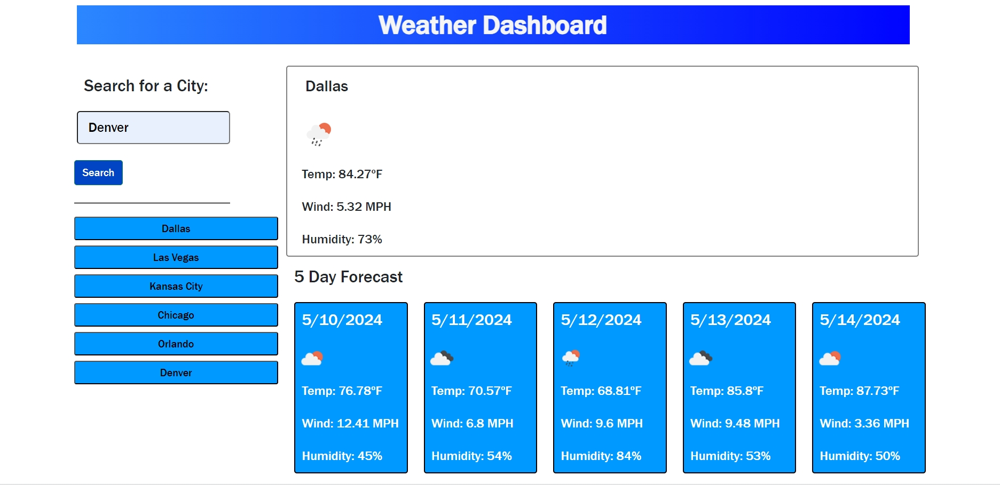

# Weather Dashboard

## Description

This is a dashboard used to display a user's inputted city's current weather and its 5 day forecast via the [OpenWeatherMap APIs](https://openweathermap.org/). This project taught me a couple of new things such as a function I could use to extract data from an object using `Object.values`, as noted in credits below, and more practice working with promises and creating HTML elements with Javascript.

As before with projects I laid out a concept structure of what I wanted the working product to look like via HTML and CSS. But first to get a proper structure I implemented the weather API by calling it in a `fetch()` request then analyzing the returned values. Afterwards, I grabbed the values from the returned object and stored them variable to be used later.

Next was to handle the user search for a city and giving an error message for a blank entry. Later I would add the calls for the weather now and 5 day forecast card creating functions. I also wrote another `fetch()` using the API to specifically get he latitude and longitude.

Then I got the values of a city's forecast from the "weatherData"'s object keys. I stored these in keys to be retrieved later. I also created the elements for the today's weather forecast card and the 5 day forecast cards and appended them both to the HTML. I also retrieved the weather data from the localStorage.

The next few functions were to created clear the daily weather and 5 day forecast, create the button for each respective searched city, and to repopulate the cards when a user clicks one of the past search buttons.
 
[Link to deployed application.](https://excervantes.github.io/weather-dashboard/)

## Installation

N/A

## Usage

Upon page load you will be presented with a page with a box to enter your desired city. Once you search for a city it will return the current weather in the top right box displaying city name, current conditions as represented by the weather icon, temperature, wind, and humidity.

Below that you will see a 5 day forecast of the same city displaying the date, current conditions as represented by the weather icon, temperature, wind, and humidity.

You can search more cities and as you do a button will appear below that search box displaying each previous search. You can click those buttons to once again display that respective city's weather info.

### Example of Webpage

## Library Elements Used

[Bootstrap](https://getbootstrap.com/docs/5.0/getting-started/introduction/)

## APIs Used

[OpenWeatherMap](https://openweathermap.org/)

## Credits 

"_javascript - Object.values vs Array.from, what's the difference? - Stack Overflow_. (2022, March 3). Stack Overflow. Retrieved May 7, 2024, from https://stackoverflow.com/questions/71336776/object-values-vs-array-from-whats-the-difference

## License

GNU GENERAL PUBLIC LICENSE
Version 3, 29 June 2007

See LICENSE for more info
